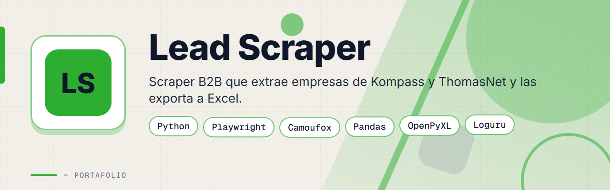
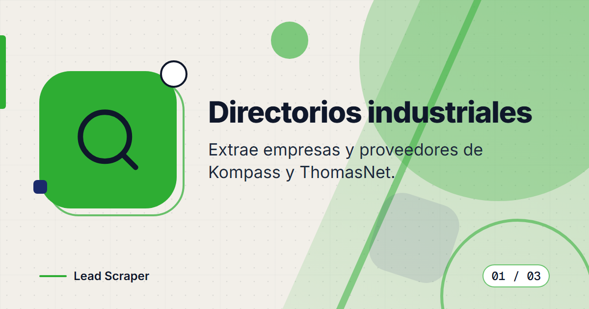
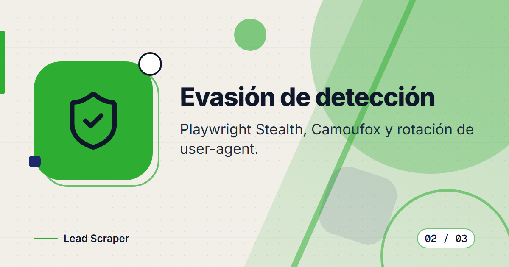
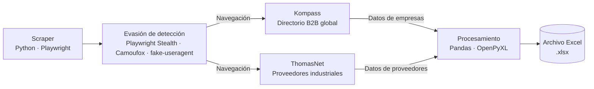

<div align="center">



# Lead Scraper


**Scraper de leads B2B para directorios industriales: extrae empresas, contactos y datos de Kompass y ThomasNet, y los exporta en formato Excel listo para prospección.**

</div>

> Este es un **portafolio showcase**: el código fuente es propietario y no está incluido.

---

## Contenido

- [El Problema](#el-problema)
- [La Solución](#la-solución)
- [Funcionalidades](#funcionalidades)
- [Vista Previa](#vista-previa)
- [Arquitectura](#arquitectura)
- [Stack Tecnológico](#stack-tecnológico)
- [Instalación local](#instalación-local)
- [Roadmap](#roadmap)
- [Contacto](#contacto)

---

## El Problema

Los equipos de ventas B2B en sectores industriales necesitan listas de prospectos calificados: empresas con nombre, industria, ubicación, tamaño y datos de contacto. Las bases de datos comerciales son costosas y suelen estar desactualizadas. Los directorios públicos como Kompass y ThomasNet tienen la información, pero no exponen una API.

---

## La Solución

Un scraper automatizado con técnicas de evasión de detección que navega los directorios B2B, extrae los datos relevantes de cada empresa y los exporta a Excel con columnas limpias, listas para importar a cualquier CRM.

---

## Funcionalidades

| Funcionalidad | Descripción |
|---------------|-------------|
| Scraping de Kompass | Extracción de empresas por industria, país y tamaño |
| Scraping de ThomasNet | Extracción de proveedores industriales por categoría y ubicación |
| Evasión de detección | Playwright Stealth, Camoufox y rotación de user-agent |
| Exportación a Excel | Salida en `.xlsx` con columnas: empresa, industria, país, contacto, teléfono y web |
| Logs detallados | Registro de progreso y errores con Loguru |
| Reintentos automáticos | Lógica de reintentos con backoff exponencial mediante Tenacity |

---

## Vista Previa

<table>
  <tr>
    <td width="50%">
      
      <br><b>Directorios industriales</b>: Kompass y ThomasNet como fuentes de datos.
    </td>
    <td width="50%">
      
      <br><b>Evasión de detección</b>: Playwright Stealth, Camoufox y rotación de user-agent.
    </td>
  </tr>
  <tr>
    <td width="50%">
      
      <br><b>Exportación a Excel</b>: archivo <code>.xlsx</code> con columnas listas para el CRM.
    </td>
    <td></td>
  </tr>
</table>

---

## Arquitectura



Los reintentos con backoff exponencial (Tenacity) y el registro de eventos (Loguru) acompañan todo el flujo de extracción.

### Fuentes de datos

| Directorio | Descripción |
|-----------|-------------|
| [Kompass](https://kompass.com) | Directorio B2B global con más de 70 millones de empresas en 70 países |
| [ThomasNet](https://thomasnet.com) | Directorio de proveedores industriales en Norteamérica |

---

## Stack Tecnológico

| Capa | Tecnología |
|------|-----------|
| Automatización | Python · Playwright · Playwright-stealth |
| Anti-detección | Camoufox · fake-useragent |
| Procesamiento | Pandas · OpenPyXL |
| Logs | Loguru |
| Reintentos | Tenacity |

---

## Instalación local

> **Aviso:** el código es privado y propietario. Estos pasos son solo para colaboradores autorizados con acceso al repositorio.

1. Instala Python 3.
2. Crea un entorno virtual e instala las dependencias del proyecto.
3. Instala los navegadores de Playwright:
   ```bash
   playwright install
   ```
4. Ejecuta el scraper y revisa el archivo `.xlsx` generado.

---

## Roadmap

- [ ] Agregar más directorios industriales como fuentes de datos.
- [ ] Exportación directa a CRM además de Excel.
- [ ] Panel para configurar industria, país y categoría sin tocar el código.

---

## Contacto

El código fuente es propietario. Para consultas o propuestas, escríbeme:

[](mailto:pablozam1931@gmail.com)
[%206517--1870-25D366?style=for-the-badge&logo=whatsapp&logoColor=white)](https://wa.me/50765171870)
[](https://github.com/deadlyrat)

- Correo: [pablozam1931@gmail.com](mailto:pablozam1931@gmail.com)
- WhatsApp: [(507) 6517-1870](https://wa.me/50765171870)
- GitHub: [github.com/deadlyrat](https://github.com/deadlyrat)

---

*Parte del portafolio de [deadlyrat](https://github.com/deadlyrat)*
